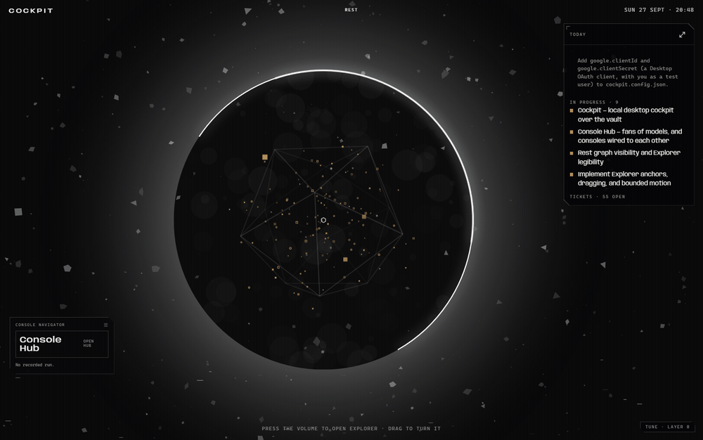

# Cockpit

Cockpit is a local desktop app where I start every working day. It shows everything in flight across my projects, mail, scheduled jobs and skills as one living graph, and it launches into the work from there. It is built with Electron, React 19 and TypeScript. The source is private; this repository documents the design language.

## The world

You look out, not down. The work graph is a volume inside a geodesic cage, and the interface is a small number of hard-edged instrument plates floating in your line of sight. You can turn the volume by hand, and pressing it flattens it into a map you can sort.

This replaces the usual agentic dashboard of panels on a dark canvas. That version was built, committed and discarded. In a panel grid the work is content inside a widget; here the work is the ground you look at, and the widgets are instruments over it. Every node resolves to a real item. A node that corresponds to nothing would turn the field into wallpaper, so it gets deleted rather than tuned.

## Three states of one field

- **Rest** (above) is the ball. Every node sits on 3D coordinates leaning toward its cluster's axis, tumbling inside an icosahedral cage around a seed at the centre. Behind it, a single broken ring of light sits on true black over a dark disc, with drifting debris around it. The ball is fitted so the cage's nearest point always stays inside the ring.
- **Explorer** is a seeded force simulation. Links are springs, cluster anchors are bodies sprung to their members, and a node you drop stays where it lands. Circle, Hex and Rings are fixed orderings of the same nodes.
- **The Sentinel** is a gimbal with one ring per cluster, weighted by count. Scrolling on it sets gravity; dragging it moves the field's centre.

Moving between them morphs rather than zooms. Every node is a shared element, so the ball releases into a flat layout over about half a second and regroups faster than it released. Zooming would say "closer". Morphing says "the same material, organised differently", which is the actual claim.

## Motion: noise, never a loop

The field is driven by value noise, not summed sines. A sum of sines is still periodic, and the eye learns it.

- **Swim.** Each particle wanders in X, Y and Z on three noise streams at its own tempo, so the volume is never still and never moves as one body.
- **Tumble.** Three independent signed noise streams turn the volume on all three axes, each able to stall and reverse. A single-axis constant spin is explicitly wrong.
- **Removed on purpose:** global breathing, cluster pulsing and alpha twinkle. They read as one organism flexing, and the graph is hundreds of separate things. Life here is displacement, not brightness.

Under `prefers-reduced-motion` all of it stops dead, and the field stays fully legible.

## Colour

The shell is achromatic: true black ground, warm off-white ink, matte plates. Colour lives only on the graph, with one hue per cluster at a shared mid-luminance.

| Cluster | Hue | Mark |
|---|---|---|
| Projects | `#B08D5B` | square, hexagon for a session summary |
| Mail | `#6F93B4` | envelope, closed when it needs you |
| Scheduled | `#5FA39A` | clock face, dashed ring when the last run failed |
| Skills | `#9A8FBE` | triangle for a skill, dot for a run |

Colour never carries state. Fill means open or needing attention, an outline means settled, and failure reads as a broken or dashed form. Nothing requires colour vision to operate. A "wants you" signal arrives once and holds; it never pulses.

## Instrument plates

Plates are not glass. Glass, with its gradient body, specular rim and soft shadow, was built and discarded.

- Matte fill, a uniform 1px hairline edge, no blur and no glow.
- Corners are cut, not rounded: the top-right and bottom-left are chamfered at 11px. This is the world's signature and applies to every plate.
- One small corner tick opposite the plate's anchor edge, and a mono uppercase header over a hairline rule.
- Plates are movable, and their positions persist.

## Type

| Role | Face |
|---|---|
| Wordmark, headings, UI | Anybody, a variable width face, set wide for display |
| Data, paths, counts, durations | Cascadia Mono |

Cascadia is a product decision, not flavour: the embedded terminals render in it, so widget data and terminal output speak in one voice. Both faces are self-hosted, because the app opens offline.

## Related

Cockpit hands agent sessions to [Console Hub](https://github.com/RayDomD/Console-Hub), a separate app that owns every terminal, recipe and mission.
